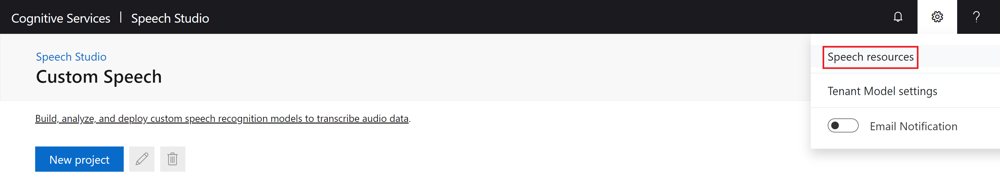

# 1. Project Setup

Create the Azure resources and set up Git to begin developing Custom Speech models.

### Table of Contents

* [Use this Template](#Use-this-Template)
* [Use Git Large File Storage (Optional)](#Use-Git-Large-File-Storage-(Optional))
    * [Edit the YAML to Use LFS](#Edit-the-YAML-to-Use-LFS)
    * [Convert Files to Git LFS](#Convert-Files-to-Git-LFS)
* [Create the Resource Group and Resources](#Create-the-Resource-Group-and-Resources)
* [Create the Speech Project](#Create-the-Speech-Project)
* [Create the Service Principal](#Create-the-Service-Principal)
* [Validate GitHub Secrets](#Validate-GitHub-Secrets)
* [Protect the Master Branch](#Protect-the-Master-Branch)
* [Next Steps](#Next-Steps)

## Use this Template

[Generate a copy of this template repository](https://github.com/KatieProchilo/CustomSpeechDevOpsSample/generate) to hold the code and the GitHub Actions pipelines:

1. Enter a name for the repository where prompted.
2. Leave **Include all branches** unchecked. You only need to copy the master branch of this repository.
3. Click **Create repository from template** to create your copy.

[Clone the repository](https://help.github.com/en/github/creating-cloning-and-archiving-repositories/cloning-a-repository). Use this repository to walk through this guide and for your own experimentation.

## Use Git Large File Storage (Optional)

[Git Large File Storage](https://git-lfs.github.com/) (Git LFS) optimizes operations for large files to occur only when the files are interacted with specifically. Git can be used in the same way it's always been used while Git LFS manages data from the .zip files in the background.

There are alternatives to managing the data with Git LFS, but Git LFS doesn't require additional tooling and is cheaper than storing large files with Git. This is at the cost of paying more for storage than using a solution with Azure Blob Storage for example, but with the amount of data typically used for Custom Speech models, this will probably not be a very high cost. [Customize this solution to use different storage](4-advanced-customization.md#Configure-Different-Data-Storage) options if you choose.

### Edit the YAML to Use LFS

The template repository was not developed with Git LFS, so three edits will have to be made to the two YAML files in `.github/workflows`.

Once in `speech-train-data-ci-cd.yml` and once in `speech-test-data-ci.yml` is the following YAML:

```yml
    # lfs: true

# - name: Checkout LFS objects
#   run: git lfs checkout
```

Uncomment the YAML in both of its locations so that instead it looks like this:

```yml
    lfs: true

- name: Checkout LFS objects
  run: git lfs checkout
```

There is one more change to make in `speech-train-data-ci-cd.yml` with the following YAML:

```yml
#   with:
#     lfs: true

# - name: Checkout LFS objects
#   run: git lfs checkout
```

Uncomment the YAML to look like this:

```yml
  with:
    lfs: true

- name: Checkout LFS objects
  run: git lfs checkout
```

Commit the changes:

```bash
git add .
git commit -m "Checkout with LFS."
```

### Convert Files to Git LFS

Download the [Git LFS command line extension for Windows](https://github.com/git-lfs/git-lfs/releases/download/v2.10.0/git-lfs-windows-v2.10.0.exe) or find [OS-specific guidance](https://github.com/git-lfs/git-lfs/wiki/Installation).

Change into your repository's directory and install Git LFS. Every developer working on the project in the future should download and install Git LFS, but they do not need to do anything else:

```bash
git lfs install
```

Track the testing and training data, and add them as Git LFS objects:

```bash
git lfs track "*.zip"
git add .gitattributes
git commit -m "Track large files with LFS."
```

The testing and training data is currently stored as Git objects and needs to be converted to Git LFS objects. First, you need to remove the testing and training data Git objects:

```bash
git rm --cached "*.zip"
git add "*.zip"
git commit -m "Convert large files from last commit to LFS."
git push
git lfs ls-files
```

Running `git lfs ls-files` in the above command should output two files that Git LFS is successfully managing. For example:

```bash
7aeb3069fa - testing/audio-and-trans.zip
3a7ddef774 - training/audio-and-trans.zip
```

If needed, [purchase more large file storage](https://help.github.com/en/github/setting-up-and-managing-billing-and-payments-on-github/upgrading-git-large-file-storage) through GitHub.

Now, Custom Speech models can be quickly developed and versioned with commits, tags, and releases in the same way that the rest of the repository is versioned.

## Create the Resource Group and Resources

Developing Custom Speech models with the CI/CD pipeline requires an Azure Resource Group, under which an Azure Speech Resource and an Azure Storage Account must be created. To create these resources, click the Deploy to Azure button below:

[](https://portal.azure.com/#create/Microsoft.Template/uri/https%3A%2F%2Fraw.githubusercontent.com%2FKatieProchilo%2FDeployToAzure%2Fmaster%2Fazuredeploy.json)

Enter the values as follows and save them for later use:

* **Resource Group:** Up to 90 alphanumeric characters, periods, underscores, hyphens and parenthesis. Cannot end in a period.
* **Location:** Select the region from the dropdown that's best for your project.
* **STORAGE_ACCOUNT_NAME:** 8-24 alphanumeric characters. Must be unique across Azure.
    * [Create a GitHub Secret](https://help.github.com/en/actions/configuring-and-managing-workflows/creating-and-storing-encrypted-secrets#creating-encrypted-secrets) called `STORAGE_ACCOUNT_NAME` and set it to this value.
* **STORAGE_ACCOUNT_REGION:** Select the region from the dropdown that's best for your project.
* **SPEECH_RESOURCE_NAME:** 2-64 alphanumeric characters, underscores, and hyphens.
* **SPEECH_RESOURCE_REGION:** Select the region from the dropdown that's best for your project.
    * [Create a GitHub Secret](https://help.github.com/en/actions/configuring-and-managing-workflows/creating-and-storing-encrypted-secrets#creating-encrypted-secrets) called `SPEECH_RESOURCE_REGION` and set it to this value.

Agree to the terms and click **Purchase** to create the Resource Group and Resources. Fix any validation errors if necessary.

## Create the Speech Project

Navigate to the [Speech Studio](https://speech.microsoft.com/portal/) and click the cog in the upper right corner, then click **Speech resources**:



Select the Speech Resource that was created in Project Setup, and then click the eye icon to see the Speech subscription key. [Create a GitHub Secret](https://help.github.com/en/actions/configuring-and-managing-workflows/creating-and-storing-encrypted-secrets#creating-encrypted-secrets) called `SPEECH_SUBSCRIPTION_KEY`, and set it to this value:


Click **Go to Studio** and [create a Speech project](https://docs.microsoft.com/en-us/azure/cognitive-services/speech-service/how-to-custom-speech#how-to-create-a-project) under this Speech Resource. [Create a GitHub Secret](https://help.github.com/en/actions/configuring-and-managing-workflows/creating-and-storing-encrypted-secrets#creating-encrypted-secrets) called `SPEECH_PROJECT_NAME` and set it to the name of the project you created.

## Create the Service Principal

[Azure Service Principals](https://docs.microsoft.com/en-us/cli/azure/create-an-azure-service-principal-azure-cli?toc=%2Fazure%2Fazure-resource-manager%2Ftoc.json&view=azure-cli-latest) give role-restricted access to Azure Resources. The service principal you will create will be used to log in to Azure in the workflow.

[Install the Azure CLI](https://docs.microsoft.com/en-us/cli/azure/install-azure-cli?view=azure-cli-latest) and log in to Azure:

```bash
az login
```

Execute the following command to confirm you are in the correct Azure Subscription:

```bash
az account show
```

If you have more than one subscription and the incorrect subscription is selected, set the right subscription with:

```bash
az account set -s <<NAME_OR_ID_OF_SUBSCRIPTION>>
```

Set `RESOURCE_GROUP_NAME` to the name of the Resource Group from the Deploy to Azure task. Substitute the `SUBSCRIPTION_ID` as well. Come up with a `SERVICE_PRINCIPAL_NAME` to run the command to create the service principal, which must be unique across Azure. If you see output from this command reporting that it has found an existing resource, run this command again and use a different name:

```bash
az ad sp create-for-rbac --name <<SERVICE_PRINCIPAL_NAME>> --role "Storage Blob Data Contributor" --scopes /subscriptions/<<SUBSCRIPTION_ID>>/resourceGroups/<<RESOURCE_GROUP_NAME>> --sdk-auth
```

[Create a GitHub Secret](https://help.github.com/en/actions/configuring-and-managing-workflows/creating-and-storing-encrypted-secrets#creating-encrypted-secrets) called `AZURE_CREDENTIALS` and set it to the JSON output from the command, for example:

```json
{
  "clientId": "########-####-####-####-############",
  "clientSecret": "########-####-####-####-############",
  "subscriptionId": "########-####-####-####-############",
  "tenantId": "########-####-####-####-############",
  "activeDirectoryEndpointUrl": "https:...",
  "resourceManagerEndpointUrl": "https:...",
  "activeDirectoryGraphResourceId": "https:...",
  "sqlManagementEndpointUrl": "https:...",
  "galleryEndpointUrl": "https:...",
  "managementEndpointUrl": "https:..."
}
```

## Validate GitHub Secrets

GitHub Secrets serve as parameters to the workflow, while also hiding secret values. When viewing the logs for a workflow on GitHub, secrets will appear as `***`.

Ensure each of the following secrets have been set:


## Protect the Master Branch

This solution uses [GitHub Flow](https://guides.github.com/introduction/flow/), which involves creating feature branches and merging them into **master**. This approach is lightweight, but illustrates the basics of protecting branches. To protect multiple or different branches like **master** and **develop** read about [Changing Branch Configurations](4-advanced-customization.md#Changing-Branch-Configurations).

Branch policies should be configured to prevent direct pushes to the master branch. They should require changes to be checked in by creating a Pull Request and getting these changes approved by collaborators in the repository.

***Important:*** *Individual GitHub accounts must be public or have a GitHub Pro subscription to enforce branch protections. If you are using a private repository with a personal GitHub account, you will have to change your repository to be public in repository settings.*

To configure these protections:

1. In the home page for your repository, click **Settings**.
2. On the Settings page, click on **Branches** in the Options menu.
3. Under **Branch protection rules**, click the **Add rule** button.
4. Configure the rule:
    1. In the **Branch name pattern** box, enter **master**.
    2. Check **Require pull request reviews before merging**.
    3. Do **not** check **Include administrators**. Later you will need to use your administrator privileges to bypass merging restrictions. Once multiple people are contributing to the project, consider configuring these restrictions for administrators as well.
    4. Click the **Create** button at the bottom of the page.

## Next Steps

The project has now been set up and you can move on to [Create the Initial Custom Speech Model](./2-create-the-initial-custom-speech-model.md).