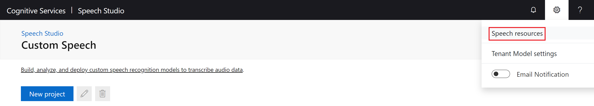
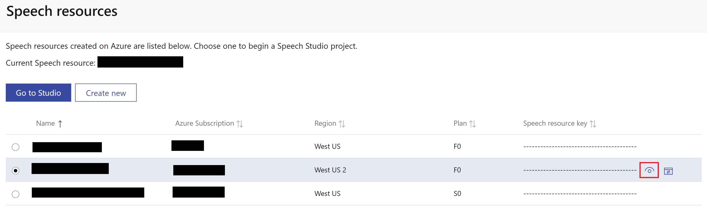
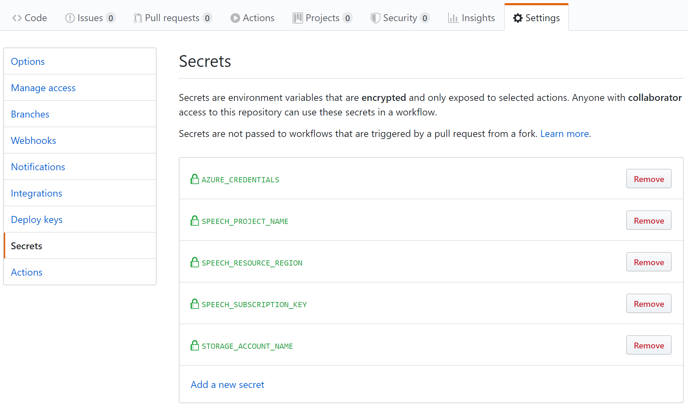

# 1. Setup

This document shows how to create your GitHub repository from this template, create your Azure resources, and configure the [GitHub Actions](https://help.github.com/en/actions) workflows so you can begin developing Custom Speech models.

## Table of contents

- [Create your repo](#Create-your-repo)
- [Provision Azure resources](#Provision-Azure-resources)
- [Create the Speech project](#Create-the-Speech-project)
- [Create GitHub secrets](#Create-GitHub-secrets)
- [Create the Azure Service Principal](#Create-the-Azure-Service-Principal)
- [Protect the master branch](#Protect-the-master-branch)
- [Next steps](#Next-steps)

## Create your repo

Use this template to create a GitHub repository for your development with all the files and folders from this template repository.

To create your repository:

1. If you don't already have a GitHub account, create one by following the instructions at [Join GitHub: Create your account](https://github.com/join).
1. Click the green **Use this template** button on the home page of this repo to create a new repo with the same files and folders as the template.

    

    1. Enter your own **Repository name** where prompted.
    1. Select **Private** if you want to create a private repository.

        >**Note**: The template works with public repositories by default. If you create a private repository, you will need to [configure the workflows](4-advanced-customization.md##Change-Environment-Variables) for use with a  private repository.

    1. Leave **Include all branches** unchecked as you only need the master branch.
    1. Click **Create repository from template** to create your copy of this repository.

1. After your repository is created, [clone the repository](https://help.github.com/en/github/creating-cloning-and-archiving-repositories/cloning-a-repository).

>**Note**: If you are using this solution as the starting point for a Custom Speech project with a lot of data, consider [configuring Git Large File Storage](4-advanced-customization.md#Use-Git-Large-File-Storage) to manage large files.

## Provision Azure resources

Developing Custom Speech models requires an Azure Resource Group with an Azure Speech Resource and an Azure Storage Account.

To create these resources:

1. Click the **Deploy to Azure** button below:

    [](https://portal.azure.com/#create/Microsoft.Template/uri/https%3A%2F%2Fraw.githubusercontent.com%2FAzure-Samples%2FSpeech-Service-DevOps-Template%2Fmaster%2Fazuredeploy.json)

1. Enter the values in the template, including:

    - **Resource Group:** Up to 90 alphanumeric characters, periods, underscores, hyphens and parenthesis. Cannot end in a period.
    - **Region:** Select the region from the dropdown that's best for your project.
    - **SPEECH_PRICING_TIER:** Only one free (F0) Speech resource is allowed per Azure Subscription.
    - **SPEECH_RESOURCE_NAME:** 2-64 alphanumeric characters, underscores, and hyphens.
    - **SPEECH_RESOURCE_REGION:** Select the region from the dropdown that's best for your project.
    - **STORAGE_ACCOUNT_NAME:** 8-24 alphanumeric characters. Must be unique across Azure.
    - **STORAGE_ACCOUNT_REGION:** Select the region from the dropdown that's best for your project.

    >**Note**: Save the `Resource Group`, `STORAGE_ACCOUNT_NAME` and  `SPEECH_RESOURCE_REGION` values. You will need them when you configure the GitHub Actions workflows.

1. Click **Review + create**.
1. Agree to the terms, and click **Create**.

## Create the Speech project

Create a Speech Project in [Speech Studio](https://speech.microsoft.com/portal/) for your project.

To create the project:

1. Open [Speech Studio](https://speech.microsoft.com/portal/) and click the cog in the upper right corner, then click **Speech resources**:

    

1. Select the Speech resource that was created in the previous step. If you cannot see your Speech resource, wait for a short while and refresh the page.
1. Click the eye icon to reveal the **Speech resource key**.
    >**Note**: Take note of this key for use later on.

    

1. Click **Go to Studio**.
1. Select **Custom Speech**.
1. Click **New project** to create a new [Speech Project](https://docs.microsoft.com/en-us/azure/cognitive-services/speech-service/how-to-custom-speech#how-to-create-a-project) and fill out the dialog:
    1. **Name**: Enter a name for the project.
        >**Note**: Take note of the name of your project for use later on.
    1. **Description**: Enter a description.
    1. **Language**: Select _English (United States)_.

## Create GitHub secrets

[GitHub secrets](https://help.github.com/en/actions/configuring-and-managing-workflows/creating-and-storing-encrypted-secrets#creating-encrypted-secrets) serve as parameters to the GitHub Actions workflow while keeping those values secret. When viewing the workflow logs, secrets will appear as `***`.

To create your GitHub secrets:

1. Click the **Settings** tab on the home page of your repository.
1. Select **Secrets** in the Options menu.
1. For each secret below, click **New secret**, enter the **Name** and **Value** below, and click **Add secret**:

    | Name | Value |
    |-------------|-------|
    | **SPEECH_RESOURCE_REGION** | The region you selected when configuring the Azure resources |
    | **SPEECH_SUBSCRIPTION_KEY** | The speech subscription key |
    | **SPEECH_PROJECT_NAME** | The speech project name |
    | **STORAGE_ACCOUNT_NAME** | Azure storage account name |

## Create the Azure Service Principal

Create an [Azure Service Principal](https://docs.microsoft.com/cli/azure/create-an-azure-service-principal-azure-cli) to allow the GitHub Actions workflows to login using that identity and work with Azure resources using role-restricted access.

A Powershell script `/setup/create_sp.ps1` is provided to create the Azure Service Principal.

To create the Azure Service Principal:

1. Go to [Azure Cloud Shell](https://shell.azure.com).
    - Complete the initialization procedure if this is the first time you've used Azure Cloud Shell.
1. Select the **Azure subscription** used to create the Azure resources above.
1. Select **Powershell** at the top left of the terminal taskbar.

1. Click the **Upload/Download** button on the taskbar.

    

1. Select **Upload** and navigate to the **/setup/create_sp.ps1** file in your repo.

1. After the file has finished uploading, execute it in the terminal by entering the following command:

    ```powershell
    ./create_sp.ps1
    ```

1. Enter a **Service Principal name** and your **Azure Resource Group** from above.

    > **IMPORTANT:** The Service Principal name you use must be unique within your Active Directory. When prompted enter your own unique name or hit **Enter** to use the auto-generated unique name.

    

1. As prompted, copy the JSON that is returned.

    ```json
    {
      "clientId": "########-####-####-####-############",
      "clientSecret": "########-####-####-####-############",
      "subscriptionId": "########-####-####-####-############",
      "tenantId": "########-####-####-####-############",
      "activeDirectoryEndpointUrl": "https:...",
      "resourceManagerEndpointUrl": "https:...",
      "activeDirectoryGraphResourceId": "https:...",
      "sqlManagementEndpointUrl": "https:...",
      "galleryEndpointUrl": "https:...",
      "managementEndpointUrl": "https:..."
    }
    ```

1. Using the process above, create a GitHub Secret named `AZURE_CREDENTIALS` with a value of the JSON above.

    

## Protect the master branch

It's a software engineering best practice to protect the master branch from direct check-ins. Read [configuring protected branches](https://help.github.com/en/github/administering-a-repository/configuring-protected-branches) to learn more about protecting branches in GitHub.

> **Important:** Branch protections are supported on public GitHub repositories, or if you have a GitHub Pro subscription. If you are using a personal GitHub account and you created your repository as a private repository, you will have to change your repository to be **public**.

The GitHub Actions workflows in this repository are configured to run when a merge to master occurs, for example after a PR is merged.
Branch Protections are not required for these events to occur, so setting branch protections is optional.

Configure branch protections according to your established software engineering process. If you don't have established branch protection policies, configure branch protections as follows:

1. Click the **Settings** tab on the home page of your repository.
1. Select **Branches** in the left menu.
1. Under **Branch protection rules**, click **Add rule**.
1. Enter the following for the rule:
    1. In the **Branch name pattern** box, enter **master**.
    1. Check **Require pull request reviews before merging**.
    1. Do **not** check **Include administrators**.
        - You will use your administrator privileges to bypass merge restrictions later in this walk through.
        - After the walk through, consider configuring these restrictions for administrators as well.
1. Click **Create**.

## Next steps

In this step, you created your GitHub repository from the template, created your Azure resources, and configured the GitHub Actions workflows so you can begin developing Custom Speech models using your repo.

In the next step, find out how to [test the baseline model](./2-test-the-baseline-model.md) using the data in the `testing` folder of your repository.

See the following documents for more information on this template and the engineering practices it demonstrates:

- [Test the baseline model](2-test-the-baseline-model.md#table-of-contents)
- [Improve the model](3-improve-the-model.md#table-of-contents)
- [Advanced customization](4-advanced-customization.md#table-of-contents)
