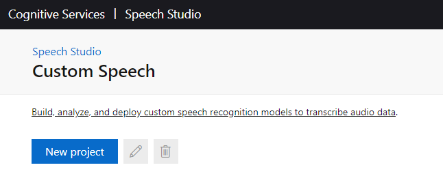

# 1. Setup

Create the Azure resources and set up Git to begin developing Custom Speech models.

### Table of Contents

- [1. Setup](#1-setup)
    - [Table of Contents](#table-of-contents)
  - [Get the code](#get-the-code)
  - [Clone your repository](#clone-your-repository)
  - [Create an Azure Resource Group and a set of Azure Resources](#create-an-azure-resource-group-and-a-set-of-azure-resources)
  - [Create the Speech Project](#create-the-speech-project)
  - [Create the Service Principal](#create-the-service-principal)
  - [Validate GitHub Secrets](#validate-github-secrets)
  - [Protect the Master Branch](#protect-the-master-branch)
  - [Next Steps](#next-steps)

## Get the code

You'll use a GitHub repository and GitHub Actions for running the multi-stage pipeline with build, testing, and release stages.

To create your repository:

* If you don't already have a GitHub account, create one by following the instructions at [Join GitHub: Create your account](https://github.com/join).
* Click the green **Use this template** button near the top of the [Speech-Service-DevOps-Samples](https://github.com/Azure-Samples/Speech-Service-DevOps-Samples) home page for this GitHub repo. This will copy this repository to a GitHub repository of your own that it will create.

   

  * Enter your own repository name where prompted.
  * Leave **Include all branches** unchecked as you only need the master branch of the source repo copied.
  * Click **Create repository from template** to create your copy of this repository.

The solution works with public repositories by default. To create a private repository, select **Private** and [change the `IS_PRIVATE_REPOSITORY` environment variable](4-advanced-customization.md##Change-Environment-Variables) to `true`.

## Clone your repository

After your repository is created, clone it to your own machine.

- Follow these steps to [clone your repository](https://help.github.com/en/github/creating-cloning-and-archiving-repositories/cloning-a-repository) to your own machine.

If you are using this solution as the starting point for a Custom Speech project with a lot of data, consider [using Git Large File Storage](4-advanced-customization.md#Use-Git-Large-File-Storage) to manage large files in this repository. This will cost less compared to storing large files within Git itself.

## Create an Azure Resource Group and a set of Azure Resources

Developing Custom Speech models with the CI/CD pipeline requires an Azure Resource Group, under which an Azure Speech Resource and an Azure Storage Account must be created. To create these resources, click the Deploy to Azure button below:

**TEMPORARY:** URL behind this button is temporary while the repo is private. REMOVE THIS MESSAGE and change URL to correct target when this goes public.

[](https://portal.azure.com/#create/Microsoft.Template/uri/https%3A%2F%2Fraw.githubusercontent.com%2FKatieProchilo%2FDeployToAzure%2Fmaster%2Fazuredeploy.json)

<!--
[](https://portal.azure.com/#create/Microsoft.Template/uri/https%3A%2F%2Fraw.githubusercontent.com%2FAzure-Samples%2FSpeech-Services-DevOps-Samples%2Fmaster%2Fazuredeploy.json)
-->

Enter the values as follows and save them for later use:

* **Resource Group:** Up to 90 alphanumeric characters, periods, underscores, hyphens and parenthesis. Cannot end in a period.
* **Location:** Select the region from the dropdown that's best for your project.
* **STORAGE_ACCOUNT_NAME:** 8-24 alphanumeric characters. Must be unique across Azure.
    * [Create a GitHub Secret](https://help.github.com/en/actions/configuring-and-managing-workflows/creating-and-storing-encrypted-secrets#creating-encrypted-secrets) called `STORAGE_ACCOUNT_NAME` and set it to this value.
* **STORAGE_ACCOUNT_REGION:** Select the region from the dropdown that's best for your project.
* **SPEECH_RESOURCE_NAME:** 2-64 alphanumeric characters, underscores, and hyphens.
* **SPEECH_RESOURCE_REGION:** Select the region from the dropdown that's best for your project.
    * [Create a GitHub Secret](https://help.github.com/en/actions/configuring-and-managing-workflows/creating-and-storing-encrypted-secrets#creating-encrypted-secrets) called `SPEECH_RESOURCE_REGION` and set it to this value.

Agree to the terms and click **Review + create** to create the Resource Group and Resources. Fix any validation errors if necessary and then click **Create**.

## Create the Speech Project

The GitHub action pipelines requires access to authentication keys and other sensitive information when they are executed. To protect these details we use  [GitHub Secrets](https://help.github.com/en/actions/configuring-and-managing-workflows/creating-and-storing-encrypted-secrets).

1. Navigate to the [Speech Studio](https://speech.microsoft.com/portal/) and click the cog in the upper right corner, then click **Speech resources**:

2. Select the Speech Resource that was created in Setup, and then click the eye icon to see the Speech subscription key. [Create a GitHub Secret](https://help.github.com/en/actions/configuring-and-managing-workflows/creating-and-storing-encrypted-secrets#creating-encrypted-secrets) called `SPEECH_SUBSCRIPTION_KEY`, and set it to this value:

3. Click **Go to Studio** and select [_Custom Speech_](https://docs.microsoft.com/en-us/azure/cognitive-services/speech-service/how-to-custom-speech#how-to-create-a-project) under this Speech Resource:
a. Click to create a new _Speech Project_ and enter a suitable name for the project. Use _English (United States)_ as the language.

b. [Create a GitHub Secret](https://help.github.com/en/actions/configuring-and-managing-workflows/creating-and-storing-encrypted-secrets#creating-encrypted-secrets) called `SPEECH_PROJECT_NAME` and set it to the name of the project.
c. Under **Language**, select the language you will use for testing and training models. The project is configured for **English (United States)**. To use other languages, [change locales](4-advanced-customization.md#Change-Locales).

## Create the Service Principal

You need to configure an [Azure Service Principal](https://docs.microsoft.com/en-us/cli/azure/create-an-azure-service-principal-azure-cli?toc=%2Fazure%2Fazure-resource-manager%2Ftoc.json&view=azure-cli-latest) to allow the pipeline to login using your identity and to work with Azure resources on your behalf. You will save the access token for the service principal in the GitHub Secrets for your repository.

1. Install the Azure CLI on your machine, if not already installed. Follow these steps to [install the Azure CLI](https://docs.microsoft.com/cli/azure/install-azure-cli?view=azure-cli-latest) on your system.

1. Open a Powershell or Bash terminal window in the root folder of your cloned repository. and log into Azure:

    ```bash
    az login
    ```

   If the CLI can open your default browser, it will do so and load an Azure sign-in page. Sign in with your account credentials in the browser.

   Otherwise, open a browser page at <https://aka.ms/devicelogin> and enter the authorization code displayed in your terminal.

2. Show the selected azure subscription. If you have more than one subscription then you should ensure that the selected subscrption is the one in which you have created your *resource group* above. If you do not have the correct subscription selected then use the `az account set` command:

   ```bash
   az account show
   az account set -s {Name or ID of subscription}
   ```
   
3. Set `RESOURCE_GROUP_NAME` to the name of the Resource Group from the Deploy to Azure task. Substitute the `AZURE_SUBSCRIPTION_ID` as well. Come up with a `SERVICE_PRINCIPAL_NAME` to run the command to create the service principal, which must be unique across Azure. If you see output from this command reporting that it has found an existing resource, run this command again and use a different name:

```bash
az ad sp create-for-rbac --name <<SERVICE_PRINCIPAL_NAME>> --role "Storage Blob Data Contributor" --scopes /subscriptions/<<AZURE_SUBSCRIPTION_ID>>/resourceGroups/<<RESOURCE_GROUP_NAME>> --sdk-auth
```

[Create a GitHub Secret](https://help.github.com/en/actions/configuring-and-managing-workflows/creating-and-storing-encrypted-secrets#creating-encrypted-secrets) called `AZURE_CREDENTIALS` and set it to the JSON output from the command, for example:

```json
{
  "clientId": "########-####-####-####-############",
  "clientSecret": "########-####-####-####-############",
  "subscriptionId": "########-####-####-####-############",
  "tenantId": "########-####-####-####-############",
  "activeDirectoryEndpointUrl": "https:...",
  "resourceManagerEndpointUrl": "https:...",
  "activeDirectoryGraphResourceId": "https:...",
  "sqlManagementEndpointUrl": "https:...",
  "galleryEndpointUrl": "https:...",
  "managementEndpointUrl": "https:..."
}
```

## Validate GitHub Secrets

GitHub Secrets serve as parameters to the workflow, while also hiding secret values. When viewing the logs for a workflow on GitHub, secrets will appear as `***`.

Ensure each of the following secrets have been set:


## Protect the Master Branch

This solution uses [GitHub Flow](https://guides.github.com/introduction/flow/), which involves creating feature branches and merging them into **master**. This approach is lightweight, but illustrates the basics of protecting branches. To protect multiple or different branches like **master** and **develop** read about [changing branching strategies](4-advanced-customization.md#Configure-a-Clean-Master).

Branch policies should be configured to prevent direct pushes to the master branch. They should require changes to be checked in by creating a pull request and getting these changes approved by collaborators in the repository.

***Important:*** *Individual GitHub accounts must be public or have a GitHub Pro subscription to enforce branch protections. If you are using a private repository with a personal GitHub account, you will have to change your repository to be public in repository settings.*

To configure these protections:

1. In the home page for your repository, click **Settings**.
2. On the Settings page, click on **Branches** in the Options menu.
3. Under **Branch protection rules**, click the **Add rule** button.
4. Configure the rule:
    1. In the **Branch name pattern** box, enter **master**.
    2. Check **Require pull request reviews before merging**.
    3. Do **not** check **Include administrators**. Later you will need to use your administrator privileges to bypass merging restrictions. Once multiple people are contributing to the project, consider configuring these restrictions for administrators as well.
    4. Click the **Create** button at the bottom of the page.

## Next Steps

The repository has been initialized with branch protections and GitHub secrets for the Azure Service Principal and Azure resources. Now [create an initial custom speech model](./2-train-an-initial-model.md) using data stored in the `testing` and `training` folder of the repository.
