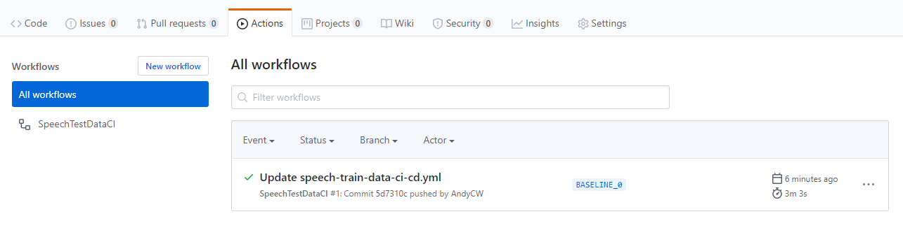

# 2. Test the baseline model

Follow these steps to understand the workflow and create a baseline Speech model without customization. This baseline model will be used as an accuracy benchmark to compare against future customized models.

## Table of contents

* [Push a baseline tag](#Push-a-baseline-tag)
* [Confirm the workflow results](#Confirm-the-workflow-results)
* [Next steps](#Next-steps)

## Push a baseline tag

Push a tag beginning with `BASELINE` to test the latest baseline model against data in the `testing` folder and create a benchmark for future Custom Speech models to outperform. A baseline Speech model is an un-customized model that works best for generic solutions without custom or out-of-vocabulary words. If you start development of a Custom Speech model with a baseline model, it's easy to see when your changes to the Custom Speech model improve its recognition accuracy.

The **SpeechTestDataCI** GitHub Actions workflow executes this test and can be found at `.github/workflows/speech-test-data-ci.yml`. Any time a tag is pushed beginning with `BASELINE`, it uses data in the `testing` folder to test the latest baseline model. Each tag should be unique since duplicate tags will cause test results and summaries to be overwritten in Azure Blob storage. It is recommended to use some sort of versioning in tag names as well.

1. To push an [annotated tag](https://www.atlassian.com/git/tutorials/inspecting-a-repository/git-tag), which simply has extra meta data compared to lightweight tags:

```bash
git checkout master
git pull
git tag -a BASELINE_0
git push origin BASELINE_0
```

The **SpeechTestDataCI** workflow also executes when data in the `testing` folder is updated, but do not include changes to the test data when you push a baseline tag since it causes unintended behavior.

## Confirm the workflow results

When you push a baseline tag to **master**, the **SpeechTestDataCI** workflow tests the latest baseline model against the test data and outputs a test summary and test results which are stored in the `test-results` container. Since this is the first time you have run any tests, the results will become the benchmark that future models must outperform.

### View the workflow run

The **SpeechTestDataCI** workflow triggers from pushing a tag to **master** beginning with `BASELINE`, or from updating data in the `testing` folder.

To view the workflow run for your tag:

1. Navigate to the **Actions** tab of your repository.
1. Select **SpeechTestDataCI** on the left navigation menu.
1. Select the event that represents your tag.

    

1. Wait for the jobs to complete successfully.
1. Familiarize yourself with the jobs and steps in the workflow.

### View the test results

The workflow tests the baseline model's accuracy using [audio + human-labeled transcripts](https://docs.microsoft.com/azure/cognitive-services/speech-service/how-to-custom-speech-test-and-train#audio--human-labeled-transcript-data-for-testingtraining) supplied at `testing/audio-and-trans.zip` and creates a test summary and a test results file. The test summary contains the [Word Error Rate](https://docs.microsoft.com/azure/cognitive-services/speech-service/how-to-custom-speech-evaluate-data#what-is-word-error-rate-wer) (WER) for that test, which is an industry-standard metric to measure recognition accuracy. In the next step when you attempt to [improve the model](3-improve-the-model.md), the WER from your Custom Speech model must perform better than the WER from this baseline test.

The workflow stores the test summary and test results in an Azure Storage container called `test-results`. The workflow also creates an Azure Storage container called `configuration` with a single file, `benchmark-test.txt`. This file contains the name of the test summary for the model with the best WER, establishing a benchmark to compare future models against.

To view the test files and the file name of the current benchmark test summary:

1. Open [Azure Portal](https://ms.portal.azure.com/#home) and navigate the Azure Storage Account created in [Setup](1-setup.md#Table-of-contents).
1. Under **Tools and SDKs**, select **Storage Explorer (preview)**.
1. Select **BLOB CONTAINERS** in the navigation menu on the left.
1. Select the **test-results** container.
1. Open the `test-summary-from-baseline-tag-BASELINE_0.json` file to view the test results from your baseline model.
1. Select the **configuration** container.
1. Open `benchmark-test.txt` and confirm it contains the name of the test summary file from the baseline model, `test-results-from-baseline-tag-BASELINE_0.txt`.

The test summary becomes the benchmark the first time tests are run by a workflow. In the future, pushing a baseline tag won't overwrite the benchmark test summary in `benchmark-test.txt`, but the test files are always available in the `test-results` container where you can find the WER and other notable data.

## Next steps

Now that you understand the workflow and you've created the baseline model, in the next step you'll attempt to [improve the model](./3-improve-the-model.md) by replacing data in the `testing` and `training` folders and comparing the results against the baseline model.

See the following documents for more information on this template and the engineering practices it demonstrates:

* [Setup](1-setup.md#table-of-contents)

* [Improve the model](3-improve-the-model.md#table-of-contents)

* [Advanced customization](4-advanced-customization.md#table-of-contents)
