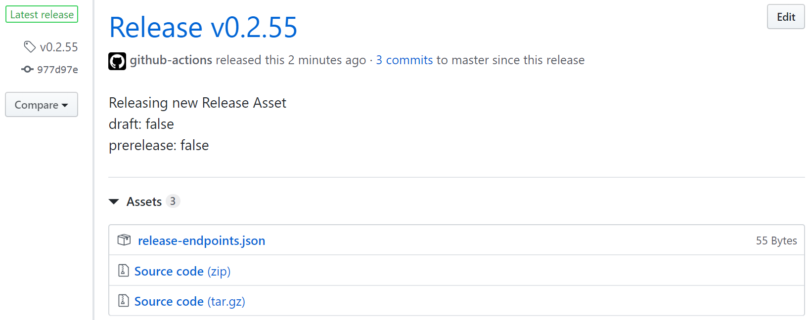

# 3. Improve the model

Follow these steps to make updates to the training and testing data to attempt to improve the model when compared to the baseline model from [Train an initial model](2-train-an-initial-model.md#table-of-contents).

During the development of a Custom Speech model, developers may make updates to the [training data](https://docs.microsoft.com/azure/cognitive-services/speech-service/how-to-custom-speech-test-and-train#audio--human-labeled-transcript-data-for-testingtraining) used to train the Custom Speech model, or to the [testing data](https://docs.microsoft.com/azure/cognitive-services/speech-service/how-to-custom-speech-test-and-train#audio--human-labeled-transcript-data-for-testingtraining) used to evaluate the accuracy of that model.

In the steps in this document, you will update both the training and the testing data. You will create a pull request with updates to the training and testing data. These updates will trigger two GitHub Action workflows:

* **SpeechTrainDataCICD** triggers on updates to training data. Its job is to build a new model from the training data and to test whether the new model has a better WER than the benchmark model.
* **SpeechTestDataCI** triggers on updates to test data. Its job is to retest the benchmark model to calculate the new Word Error rate for the benchmark model with the changed test data.

A new model must have a better WER than a benchmark model for the workflow to release an endpoint for the new model and for the new model to become the new benchmark for future iterations.

To do this, you will:

* [Create a feature branch](#1-create-a-feature-branch)
* [Update testing data](#update-testing-data)
* [Update training data](#update-training-data)
* [Create and merge the pull request](#create-and-merge-the-pull-request)
* [Understand the operation of the SpeechTestDataCI workflow](#understand-the-operation-of-the-speechtestdataci-workflow) to process updates to testing data
* [Understand the operation of the SpeechTrainDataCICD workflow](#what-the-speechtraindatacicd-workflow-does) to process updates to training data

### Table of contents

* [How to make updates to a Custom Speech model](#how-to-make-updates-to-a-custom-speech-model)
  * [Create a feature branch](#create-a-feature-branch)
  * [Update testing data](#Update-testing-data)
  * [Update training data](#Update-training-data)
  * [Create and merge the pull request](#Create-and-merge-the-pull-request)
* [Understand the operation of the SpeechTestDataCI workflow](#understand-the-operation-of-the-speechtestdataci-workflow)
  * [Retest the benchmark model](#Test-the-previous-model)
* [Understand the operation of the SpeechTrainDataCICD workflow](#understand-the-operation-of-the-speechtraindatacicd-workflow)
  * [Train the new model](#train-the-new-model)
  * [Test the new model and compare WER with the benchmark model](#test-the-new-model-and-compare-wer-with-the-benchmark-model)
  * [Release an endpoint](#release-an-endpoint)
* [Next steps](#Next-steps)

## How to make updates to a Custom Speech model

During the development of a Custom Speech model, developers may make updates to the [training data](https://docs.microsoft.com/azure/cognitive-services/speech-service/how-to-custom-speech-test-and-train#audio--human-labeled-transcript-data-for-testingtraining) used to refine and train the speech-to-text model, or to the [testing data](https://docs.microsoft.com/azure/cognitive-services/speech-service/how-to-custom-speech-test-and-train#audio--human-labeled-transcript-data-for-testingtraining) used to evaluate accuracy.

In the steps in this document, you will update both the training and the testing data. You will create a pull request with updates to the testing and training data which will trigger two automation workflows:

* **SpeechTestDataCI** triggers on updates to test data. Its job is to retest the benchmark model to calculate the new Word Error rate for the benchmark model with the changed test data.
* **SpeechTrainDataCICD** triggers on updates to training data. Its job is to build a new model from the training data and to test whether the new model has a better WER than the benchmark model.

A new model must have a better WER than a benchmark model for the workflow to release an endpoint for the new model and for the new model to become the new benchmark for future iterations.

To do this, you will:

* [Create a feature branch](#1-create-a-feature-branch)
* [Update testing data](#update-testing-data)
* [Update training data](#update-training-data)
* [Create and merge the pull request](#create-and-merge-the-pull-request)
* [Understand the operation of the SpeechTestDataCI workflow](#understand-the-operation-of-the-speechtestdataci-workflow) to process updates to testing data
* [Understand the operation of the SpeechTrainDataCICD workflow](#what-the-speechtraindatacicd-workflow-does) to process updates to training data

### Create a feature branch

To begin an attempt to train a better model, navigate to the root of the repository, and create a feature branch:

```bash
git checkout master
git pull
git checkout -b newSpeechModel
```

### Update testing data

To make changes to `testing/audio-and-trans.zip`, unzip the file and edit the text in `trans.txt`. Transcript files must be formatted a certain way so do not add an additional line, do not modify the file name (**audio.wav**) at the beginning of the line, and do not delete the tab character separating the filename from the following text.

For example, you can add some words to the beginning of the text, as follows:

```txt
audio.wav	SOME UPDATE Once the test is complete, indicated by the status change to Succeeded, you'll find a WER number for both models included in your test. Click on the test name to view the testing detail page. This detail page lists all the utterances in your dataset, indicating the recognition results of the two models alongside the transcription from the submitted dataset. To help inspect the side-by-side comparison, you can toggle various error types including insertion, deletion, and substitution. By listening to the audio and comparing recognition results in each column, which shows the human-labeled transcription and the results for two speech-to-text models, you can decide which model meets your needs and where additional training and improvements are required.
```

After you have made your changes, zip the files up again and replace the original `audio-and-trans.zip` in the `testing` folder in this repo. Add and commit the changes:

```bash
git add .
git commit -m "Update testing data."
```

### Update training data

You will make updates to the training data for a Custom Speech project to improve its performance compared to the benchmark. Training data is in the `training` folder in this repo.

For example, edit the `related-text.txt` file in the `training` folder and add a new line such as:

```txt
This is language data for my second model.
```

Commit the changes you have made to the training data:

```bash
git add .
git commit -m "Update training data."
```

#### Test training data updates

Changes should be tested by the developer before a pull request is created. To do so, [create an Azure Speech resource](https://docs.microsoft.com/azure/cognitive-services/speech-service/get-started#new-resource) for personal use. [Create a Speech project](https://docs.microsoft.com/azure/cognitive-services/speech-service/how-to-custom-speech#how-to-create-a-project) under this resource to test changes you make to training data before they are submitted to a greater audience.

Now you can begin the testing loop. Each of the following three steps should be done in the [Speech Studio](https://speech.microsoft.com/portal/) until it seems that the updates to the training data have improved the model:

1. [Upload training and testing data](https://docs.microsoft.com/azure/cognitive-services/speech-service/how-to-custom-speech-test-and-train#upload-data)
2. [Train a model for Custom Speech](https://docs.microsoft.com/azure/cognitive-services/speech-service/how-to-custom-speech-train-model)
3. [Evaluate Custom Speech accuracy](https://docs.microsoft.com/azure/cognitive-services/speech-service/how-to-custom-speech-evaluate-data#create-a-test)

Tests will output a [Word Error Rate](https://docs.microsoft.com/azure/cognitive-services/speech-service/how-to-custom-speech-evaluate-data#what-is-word-error-rate-wer) (WER) which can be used to gauge whether or not the changes have generally improved the model. If so, the updates can be submitted in a pull request.

If the model did not improve, more training data should be updated and the testing loop should start over.

### Create and merge the pull request

Push the changes to the remote repository:

```bash
git push -u origin newSpeechModel
```

Create and approve a pull request from the branch **newSpeechModel** into **master**.

Merge the pull request and again navigate to the **Actions** tab of the repository to check out the two workflows that are triggered as a result:

* **SpeechTestDataCI** triggers on updates to test data. Its job is to retest the benchmark model to calculate the new Word Error rate for the benchmark model with the changed test data.
* **SpeechTrainDataCICD** triggers on updates to training data. Its job is to build a new model from the training data and to test whether the new model has a better WER than the benchmark model.

## Understand the operation of the SpeechTestDataCI workflow

**SpeechTestDataCI** runs to recalculate the WER for the benchmark model using the new test data. This ensures that when the WER of any new models that are created are compared with the WER of the benchmark, both models have been tested against the same test data.

Whenever test data is updated, the **SpeechTestDataCI** workflow re-tests the benchmark model using the updated data. The WER from this test becomes the WER for future models to beat, whether or not it has improved.

### Retest the benchmark model

Test the benchmark model with the updated data which outputs test results and a test summary. The test summary contains the WER for future models to beat.

The test summary and test results are saved in the `test-results` container that was created during the first execution of the workflow. The file `benchmark-test.txt` in the `configuration` container will be overwritten to contain the name of the benchmark test summary file that was created in this run.

## Understand the operation of the SpeechTrainDataCICD workflow

While much of the workflow for updates to training data is the same as the initial model, the key difference is that endpoints will only be created for models with a better WER than the benchmark.

### Train the new model

The data from the `training` folder is used to build a new Custom Speech model. Please note that building models will take upwards of 30 minutes.

### Test the new model and compare WER with the benchmark model

The process of testing the new model is the same as the process to [test the new model](2-train-an-initial-model.md#test-the-new-model) for the initial benchmark model. Same as before, the test summary and test results will be stored in the `test-results` container. The big difference is that now that there is a benchmark model already created, the WER of the new model is compared against the WER of the benchmark model, which is fetched from the `benchmark-test.txt` file in the Azure Storage Container named `configuration`.

#### WER is worse than the benchmark

The workflow fails if the new model's WER is worse than the benchmark model's WER. In this case, the new model will be deleted and the workflow will exit without executing the **release** job.

#### WER is better than the benchmark

The workflow will pass when the new model has a better WER than the benchmark model. The test summary from the new model will replace the benchmark results in `benchmark-test.txt`. The workflow will continue and execute the **release** job.

### Release an endpoint

If the WER has improved, a [Custom Speech endpoint](https://docs.microsoft.com/azure/cognitive-services/speech-service/how-to-custom-speech-deploy-model) is created from this new model, and a GitHub Release is created that will contain this endpoint and a copy of the repository contents at the time the release was created. Each time an endpoint is released, the repository is tagged with a new version.

To find the best-performing Custom Speech endpoint, navigate to the **Code** tab in the repository, then click the **Releases** sub-tab. At the top of the releases page will be a release with an icon next to it that says **Latest release**, the commit hash the model was built from, and the Custom Speech model's version:



The repository was tagged with this new version, and like every tag in **master** it represents an improved Custom Speech model. On the releases page, click on the file **release-endpoints.json** to download it. It will contain the Custom Speech endpoint created in the workflow:

```json
{"ENDPOINT_ID":"########-####-####-####-############"}
```

The latest release will always contain the best-performing Custom Speech endpoint. Users can update endpoints in their client applications to use the latest release at their own discretion.

## Next steps

Now you are able to continuously improve and manage models with the tools and resources in this repository. Visit [advanced customization](./4-advanced-customization.md) to use alternative branching strategies, change the file structure, and more.

The solution is using the provided sample data, so be sure to replace it with data for your project's scenario. Start with small data sets that replicate the acoustics and language that the project will encounter. For example, record audio on the same hardware and in the same acoustic environment as the end solution so that any incompatibilities can be sorted before investing in a larger data set. More audio data can be added at any time using the tools and documentation in this solution, and as the data grows it should be diverse and representative of your project's scenario at that given time.
